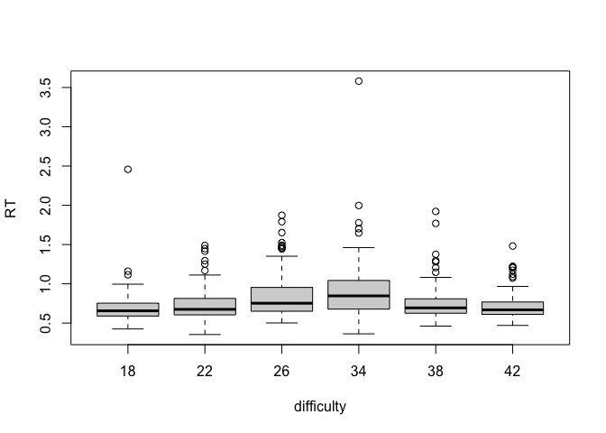

<!-- README.md is generated from README.Rmd. Please edit that file -->

# RepPack27

<!-- badges: start -->
<!-- badges: end -->

The goal of RepPack27 is to be able to apply a simple between-subjects
ANOVA (two-way) simply by using the ANOVA2_BW() function. The following
will show an example using the ‘RTDATA’ built in dataset.

## Installation

You can install the development version of RepPack27 like so:

``` r
# This is how you can install the package:

remotes::install_github("brittn27/RepPack27")
library(RepPack27)
```

## Example

This is a basic example which shows you how to solve a common problem:

``` r
library(RepPack27)
data(RTDATA)
summary(RTDATA)
#>    Picture          difficulty  depth        side     elevation  participant
#>  Length:672         18:112     far :336   left :336   down:336   01:672     
#>  Class :character   22:112     near:336   right:336   up  :336              
#>  Mode  :character   26:112                                                  
#>                     34:112                                                  
#>                     38:112                                                  
#>                     42:112                                                  
#>        RT         Correct
#>  Min.   :0.3541   0: 13  
#>  1st Qu.:0.6167   1:659  
#>  Median :0.7040          
#>  Mean   :0.7758          
#>  3rd Qu.:0.8467          
#>  Max.   :3.5806
Data <- RTDATA
```

``` r
library(RepPack27)
## basic example code  of summary --

summary(Data)
#>    Picture          difficulty  depth        side     elevation  participant
#>  Length:672         18:112     far :336   left :336   down:336   01:672     
#>  Class :character   22:112     near:336   right:336   up  :336              
#>  Mode  :character   26:112                                                  
#>                     34:112                                                  
#>                     38:112                                                  
#>                     42:112                                                  
#>        RT         Correct
#>  Min.   :0.3541   0: 13  
#>  1st Qu.:0.6167   1:659  
#>  Median :0.7040          
#>  Mean   :0.7758          
#>  3rd Qu.:0.8467          
#>  Max.   :3.5806
```

``` r
# and then an ANOVA

?ANOVA2_BW()

x <- RTDATA$difficulty
y <- RTDATA$depth
z <- RTDATA$RT

ANOVA2_BW(x,y,z)
#>              Df Sum Sq Mean Sq F value   Pr(>F)    
#> x             5   4.18  0.8370  12.547 1.18e-11 ***
#> y             1   0.14  0.1383   2.073    0.150    
#> x:y           5   0.27  0.0546   0.818    0.537    
#> Residuals   660  44.03  0.0667                     
#> ---
#> Signif. codes:  0 '***' 0.001 '**' 0.01 '*' 0.05 '.' 0.1 ' ' 1
```

You’ll still need to render `README.Rmd` regularly, to keep `README.md`
up-to-date. `devtools::build_readme()` is handy for this.

You can also embed plots, for example:



In that case, don’t forget to commit and push the resulting figure
files, so they display on GitHub and CRAN.
